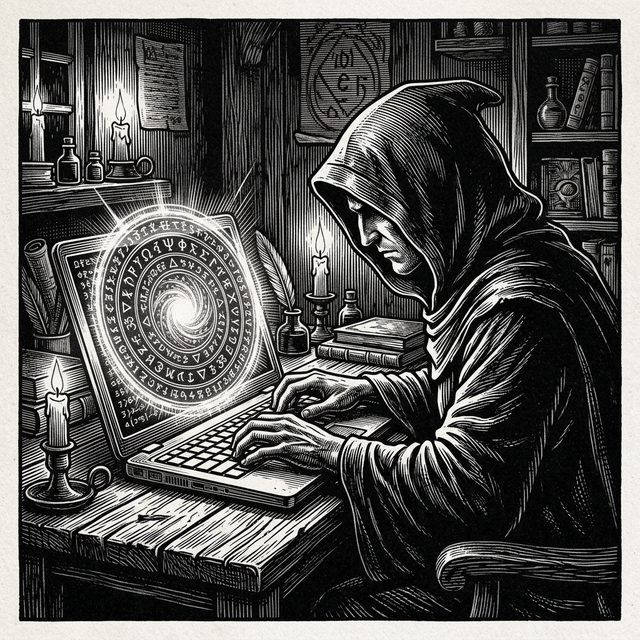

# witchaudio

> hand-cut lines. black ink. code + sound.

Building web experiences and studying audio programming.

## now
- Building tools for musicians and audio engineers
- constantly learning new things

## profile
- Full Stack Developer | QA Engineer
- Ask me about audio and music production

## find me
- github: https://github.com/witchaudio
- email: witchaudiostudios@gmail.com
- dev.to: https://dev.to/s0undw1tch

---

`make it simple. make it strange.`

