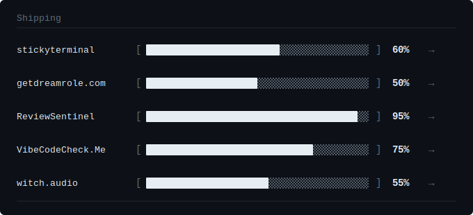

<div align="center">
  
</div>

<table>
  <tr>
      <br/>
      
      <br/><br/>
      <code>full stack dev · qa engineer</code>
      <br/>
      <code>~/witchaudio</code>
    </td>
    <td valign="top">

```
 ╔══ witchaudio v1.0 ══════════════════════════════════╗
 ║                                                      ║
 ║  Profile                                             ║
 ║    role:       full stack developer | qa engineer     ║
 ║    focus:      audio programming · web experiences   ║
 ║    ask me:     audio and music production            ║
 ║                                                      ║
 ║  Now                                                 ║
 ║    > building tools for musicians & audio engineers  ║
 ║    > constantly learning new things                  ║
 ║                                                      ║
 ║  Find Me                                             ║
 ║    github:     github.com/witchaudio                 ║
 ║    email:      witchaudiostudios@gmail.com           ║
 ║    dev.to:     dev.to/s0undw1tch                     ║
 ║                                                      ║
 ╚══════════════════════════════════════════════════════╝
```

</td>
  </tr>
</table>

<div align="center">
  
</div>

<div align="center">

```
❯ make it simple. make it strange. █
```
